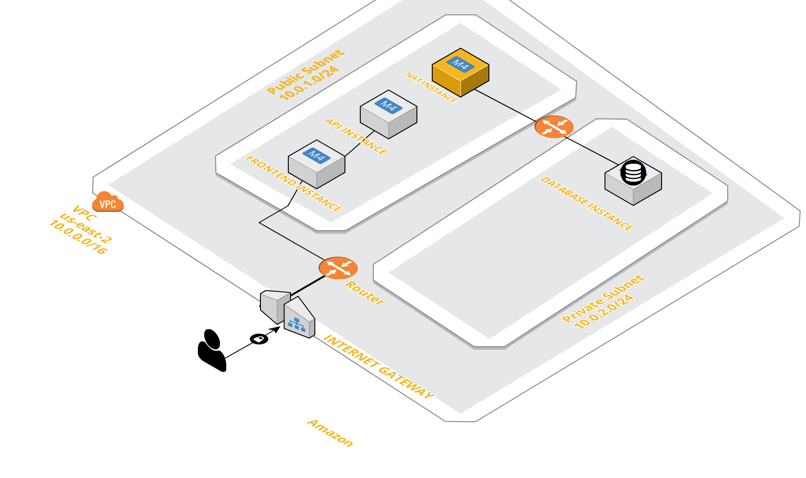

# Setting up a network with Terraform
This project sets up a network and deploy the <a href="https://github.com/andela/selene-ah-frontend">Authors Haven</a> application on AWS

## Infrastructure



When a user first visit  Author's Haven Url, it hits the frontend of the application, the frontend then makes an api call to the backend which in turns makes request to the database server to get the data back to the user . 

As shown in the diagram, There is a VPC with two subnets (One is private subnet and the other is a public subnet)
Access to the private subnet is only through the private IP of the **nat-instance**

### Prerequisites

Make sure you have the following softwares installs

- [Terraform](https://learn.hashicorp.com/terraform/getting-started/install.html)
- [Packer](https://packer.io/)
- [Ansible](https://www.ansible.com/)

## Getting Started

Use the sample.env file to create your .env file
Provide your `AWS_ACCESS_KEY_ID` and `AWS_SECRET_ACCESS_KEY` Credentials 

```
clone the repo
git clone https://github.com/ekpangmichael/Custom-Network-With-AWS-Terraform-Ansible-Packer.git
```


### Deploying

The project uses packer to build the images, Ansible to provision the images and Terraform to provision the infrastructure and deploy the project

**cd in the directory and run**
```
> bash deploy.sh -i
```
 to build the Frontend, Backend and Database Images and start provisioning the infrastructure 


### Destory the infrastructure

You can destory the whole infrastructure with one command

Run
```
> bash destroy.sh
```

Other commands

Run
```
> bash deploy.sh -h or --help to access the help commands
```


## Contributing

Feel free to contribute to this project
